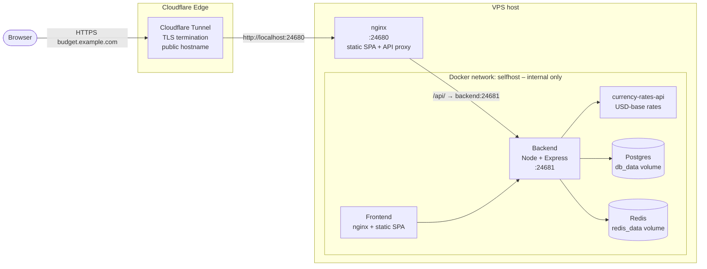
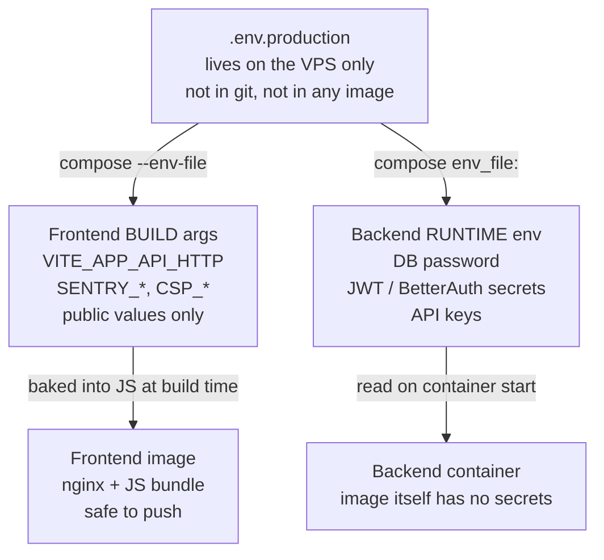

# Self-Hosting Guide

<<<<<<< HEAD
The self-hosting kit lives in [`../self-hosting/`](../self-hosting/README.md) –
start with the [setup guide](../self-hosting/docs/setup-guide.md).
=======
Run Budget Tracker on your own VPS behind a **Cloudflare Tunnel**. This guide assumes:

- A fresh Ubuntu 22.04 / 24.04 (or Debian 12) VPS
- A domain managed by Cloudflare (DNS pointed to Cloudflare's nameservers)
- **No open ports required** — Cloudflare Tunnel creates an outbound connection from your VPS to Cloudflare's edge
- 2 GB RAM minimum, 4 GB recommended (the build is the heaviest step)

The stack uses **nginx** to serve the frontend SPA and reverse-proxy `/api/`
calls to the backend. **Cloudflare Tunnel** handles TLS termination and
publishes only the frontend on port 24680. The backend has zero external
exposure — only accessible from the internal Docker network.

### What lives where



Only the frontend nginx binds a host port (24680). Postgres and Redis bind
to `127.0.0.1` on the host (admin via SSH tunnel only) and are otherwise
reachable just from the `selfhost` Docker network. The backend is not
exposed to the host at all — all API calls go through the nginx proxy.

> **Architecture**: works on both `amd64` and `arm64` VPSes (Hetzner ARM,
> Oracle Ampere, AWS Graviton). The rate-data sidecar is currently only
> published as `amd64`, so on `arm64` hosts Docker runs it under QEMU
> emulation – functional but slower at sync time. All other services
> (frontend, backend, postgres, redis) are multi-arch native.

## Table of Contents

1. [Cloudflare Tunnel setup](#1-cloudflare-tunnel-setup)
2. [Install Docker on the VPS](#2-install-docker-on-the-vps)
3. [Clone the repository](#3-clone-the-repository)
4. [Configure `.env.production`](#4-configure-envproduction)
5. [Build and start](#5-build-and-start)
6. [Run database migrations](#6-run-database-migrations)
7. [Verify](#7-verify)
8. [Updating](#8-updating)
9. [Backups](#9-backups)
10. [Localhost / no-DNS testing](#10-localhost--no-dns-testing)
11. [Environment variable reference](#environment-variable-reference)
12. [Troubleshooting](#troubleshooting)

---

## 1. Cloudflare Tunnel setup

### Prerequisites

- A domain using Cloudflare for DNS (nameservers point to Cloudflare)
- `cloudflared` installed on your VPS

### Install cloudflared

```bash
# Download cloudflared (Linux amd64)
curl -fsSL https://github.com/cloudflare/cloudflared/releases/latest/download/cloudflared-linux-amd64 -o /tmp/cloudflared
sudo install -m 755 /tmp/cloudflared /usr/local/bin/cloudflared
rm /tmp/cloudflared

# Verify
cloudflared --version
```

For other architectures, see [Cloudflare's install docs](https://developers.cloudflare.com/cloudflare-one/connections/connect-networks/downloads/).

### Authenticate and create a tunnel

```bash
cloudflared tunnel login
```

This opens a browser to authenticate with your Cloudflare account. After
logging in, create a tunnel:

```bash
cloudflared tunnel create budget-tracker
```

This creates a tunnel with a unique ID and downloads a credentials file to
`~/.cloudflared/<tunnel-id>.json`. Note the tunnel ID — you will need it
for the config file and DNS record.

### Configure the tunnel

Edit `~/.cloudflared/config.yml`:

```yaml
tunnel: <your-tunnel-id>
credentials-file: /home/your-user/.cloudflared/<tunnel-id>.json

ingress:
  - hostname: budget.example.com
    service: http://localhost:24680
  - service: http_status:404
```

Replace `budget.example.com` with your actual domain. The tunnel sends
all traffic to the frontend nginx on port 24680.

### Create DNS record

Route your domain to the tunnel:

```bash
cloudflared tunnel route dns <tunnel-id-or-name> budget.example.com
```

This creates a CNAME record from `budget.example.com` to
`<tunnel-id>.cfargotunnel.com` — no A records needed on your domain.

### Run the tunnel as a service

```bash
sudo cloudflared service install
sudo systemctl start cloudflared
sudo systemctl enable cloudflared
```

The tunnel runs as a systemd service and starts automatically on boot.

## 2. Install Docker on the VPS

Most cloud Ubuntu images ship with `curl`, `git`, and `openssl` already.
On lean images (some container hosts, custom AMIs) install them first:

```bash
sudo apt-get update
sudo apt-get install -y curl git openssl ca-certificates
```

Then add Docker's repo and install the engine + compose plugin:

```bash
# Add Docker's official repo
sudo install -m 0755 -d /etc/apt/keyrings
curl -fsSL https://download.docker.com/linux/ubuntu/gpg | sudo tee /etc/apt/keyrings/docker.asc > /dev/null
sudo chmod a+r /etc/apt/keyrings/docker.asc
echo "deb [arch=$(dpkg --print-architecture) signed-by=/etc/apt/keyrings/docker.asc] https://download.docker.com/linux/ubuntu $(. /etc/os-release && echo $VERSION_CODENAME) stable" | sudo tee /etc/apt/sources.list.d/docker.list > /dev/null
sudo apt-get update
sudo apt-get install -y docker-ce docker-ce-cli containerd.io docker-buildx-plugin docker-compose-plugin

# Allow your user to run docker without sudo (log out + back in after)
sudo usermod -aG docker "$USER"
```

Verify:

```bash
docker --version
docker compose version
```

## 3. Clone the repository

```bash
git clone https://github.com/letehaha/budget-tracker.git
cd budget-tracker
```

## 4. Configure `.env.production`

```bash
cp .env.production.example .env.production
```

Open `.env.production` and fill the **REQUIRED** section. The minimum to
boot:

```bash
# Public URL (the Cloudflare Tunnel public hostname)
BETTER_AUTH_URL=https://budget.example.com
AUTH_ORIGIN=https://budget.example.com

# Auth secrets (generate fresh, distinct values)
APPLICATION_JWT_SECRET=<paste output of: openssl rand -base64 32>
APP_SESSION_ID_SECRET=<paste output of: openssl rand -base64 32>
BETTER_AUTH_SECRET=<paste output of: openssl rand -base64 32>

# Database
APPLICATION_DB_USERNAME=budget_tracker
APPLICATION_DB_PASSWORD=<paste output of: openssl rand -base64 32>
APPLICATION_DB_DATABASE=budget_tracker

# Frontend (inlined at Docker build) — leave empty for same-origin proxy
VITE_APP_API_HTTP=
```

Generate four distinct secrets at once:

```bash
for v in APPLICATION_JWT_SECRET APP_SESSION_ID_SECRET BETTER_AUTH_SECRET APPLICATION_DB_PASSWORD; do
  printf '%s=%s\n' "$v" "$(openssl rand -base64 32)"
done
```

> **Frontend env vars (`VITE_*`) are inlined into the JS bundle at Docker
> BUILD time.** Editing them later requires `docker compose build` again.
> Backend env vars are read at container start – restart, not rebuild.

> **Keep `.env.production` on the VPS, not in the image.** The compose file
> reads it via `--env-file` (compose-level interpolation) and `env_file:`
> (runtime container env). It is never copied into the frontend or backend
> image, so DB password and auth secrets do not end up in pushed image
> layers. Do **not** check `.env.production` into git.

> The backend boots with a placeholder check – if any of
> `APPLICATION_JWT_SECRET`, `APP_SESSION_ID_SECRET`, `BETTER_AUTH_SECRET`,
> or `APPLICATION_DB_PASSWORD` is still set to `__REPLACE_ME__`, the
> container exits before serving any request.

How `.env.production` reaches each service:



The frontend image is fully public-safe – it only contains values that
the browser sees anyway. Backend secrets are mounted at container start
and never written to any image layer.

Optional features (email, OAuth login, market data, AI categorisation,
observability) are commented out at the bottom of the file. Set only what
you need; the app boots without any of them.

## 5. Build and start

```bash
docker compose -f docker/prod/docker-compose.yml --env-file .env.production up -d --build
```

The first build takes 5–15 minutes depending on VPS specs (most of it is
`npm ci` + frontend build). Subsequent builds reuse cache.

Watch the logs:

```bash
docker compose -f docker/prod/docker-compose.yml logs -f
```

## 6. Database migrations (automatic)

The backend entrypoint runs `npm run migrate` before starting the server,
so migrations apply on every boot. After `git pull` + `up -d --build`,
they run automatically when the new container starts.

To force a re-run manually (idempotent – Sequelize skips applied
migrations):

```bash
docker compose -f docker/prod/docker-compose.yml exec backend npm run migrate
```

## 7. Verify

```bash
# Frontend serves the SPA (through Tunnel)
curl -fsSI https://budget.example.com | head -1
# HTTP/2 200

# API call through nginx proxy
curl -fsS https://budget.example.com/api/v1/auth/get-session
# null

# Backend is NOT accessible directly (container-internal only)
curl -fsS http://localhost:24681/api/v1/auth/get-session
# connection refused
```

Open `https://budget.example.com` in a browser. You should see the landing
page; clicking through to **Sign Up** should let you register a user.

If you set `RESEND_API_KEY`, that user will get a verification email. If
not, they're activated immediately.

## 8. Updating

```bash
cd budget-tracker
git pull
docker compose -f docker/prod/docker-compose.yml --env-file .env.production up -d --build
```

Migrations run automatically when the new backend container starts. Watch
the logs to confirm:

```bash
docker compose -f docker/prod/docker-compose.yml logs -f backend
```

## 9. Backups

The two stateful volumes are `db_data` (Postgres) and `redis_data` (Redis).
Redis is queue-only – data is regenerated on the fly, so back up Postgres
only. The production stack includes an optional automated backup sidecar.

### 9.1 Automated backup (recommended)

The `db-backup` sidecar runs `pg_dump` on a cron schedule and saves
compressed dumps to a Docker volume (`db_backups`). It starts automatically
with the stack.

**Configuration** (set in `.env.production`):

| Variable                | Default      | Description                              |
|-------------------------|--------------|------------------------------------------|
| `BACKUP_SCHEDULE`       | `0 4 * * *`  | Cron expression (daily at 4 AM)          |
| `BACKUP_RETENTION_DAYS` | `30`         | Remove backups older than N days          |

**Manual trigger**:

```bash
docker compose -f docker/prod/docker-compose.yml exec db-backup backup.sh
```

**List backups**:

```bash
docker compose -f docker/prod/docker-compose.yml exec db-backup ls -lh /backups
```

**Copy a backup off the host**:

```bash
docker cp budget-tracker-prod-db-backup-1:/backups/db_backup_20260706_040000.sql.gz .
```

**Restore from a local backup** (using existing script):

```bash
./scripts/restore-backup.sh /path/to/db_backup_20260706_040000.sql.gz
```

**Restore from R2** (maintainer CI backups):

```bash
./scripts/restore-backup.sh
```

### 9.2 Manual one-shot backup

```bash
# Requires credentials to be set in .env.production
docker compose -f docker/prod/docker-compose.yml exec -T db \
  pg_dump -U "$APPLICATION_DB_USERNAME" "$APPLICATION_DB_DATABASE" \
  | gzip > "backup-$(date +%F).sql.gz"
```

### 9.3 Restore

```bash
gunzip -c backup-2026-05-01.sql.gz | \
  docker compose -f docker/prod/docker-compose.yml exec -T db \
  psql -U "$APPLICATION_DB_USERNAME" "$APPLICATION_DB_DATABASE"
```

### 9.4 pgAdmin (optional admin UI)

Start pgAdmin alongside the stack to browse the database via a web GUI:

```bash
docker compose --env-file .env.production \
  -f docker/prod/docker-compose.yml \
  --profile admin up -d pgadmin
```

pgAdmin is bound to `127.0.0.1:24682` — access it through an SSH tunnel
(`ssh -L 24682:localhost:24682 user@vps`). Log in with `PGADMIN_DEFAULT_EMAIL`
and `PGADMIN_DEFAULT_PASSWORD` from your `.env.production`. Register the
database server:

| Field       | Value                      |
|-------------|----------------------------|
| Host        | `db`                       |
| Port        | 5432                       |
| Username    | `$APPLICATION_DB_USERNAME` |
| Password    | `$APPLICATION_DB_PASSWORD` |

### 9.5 Redis Commander (optional admin UI)

Start Redis Commander alongside the stack to browse Redis via a web UI:

```bash
docker compose --env-file .env.production \
  -f docker/prod/docker-compose.yml \
  --profile admin up -d redis-commander
```

Redis Commander is bound to `127.0.0.1:24683` — access it through an SSH tunnel
(`ssh -L 24683:localhost:24683 user@vps`). No login required — it connects to
Redis over the internal Docker network.

## 10. Localhost / no-DNS testing

To validate the prod stack on a laptop without a Cloudflare Tunnel or
domain, use the localhost override:

```bash
# In .env.production:
VITE_APP_API_HTTP=
AUTH_ORIGIN=http://localhost:24680
BETTER_AUTH_URL=http://localhost:24680

# Then:
docker compose \
  -f docker/prod/docker-compose.yml \
  -f docker/prod/docker-compose.localhost.yml \
  --env-file .env.production \
  up -d --build
```

This mode skips TLS – do not run it on a public VPS.

---

## Environment variable reference

### Required

| Variable                 | Purpose                                      |
| ------------------------ | -------------------------------------------- |
| `NODE_ENV`               | Must be `production`                         |
| `BETTER_AUTH_URL`        | Public URL (`https://<your domain>`)         |
| `AUTH_ORIGIN`            | Same as `BETTER_AUTH_URL`                    |
| `APPLICATION_JWT_SECRET` | Encryption key for stored credentials        |
| `APP_SESSION_ID_SECRET`  | Signs request-tracing cookies                |
| `BETTER_AUTH_SECRET`     | Signs all auth sessions / tokens             |
| `APPLICATION_DB_*`       | Postgres connection (host/port/user/pass/db) |
| `APPLICATION_REDIS_HOST` | Redis hostname (defaults to `redis`)         |
| `APPLICATION_PORT`       | Backend listen port (defaults to `24681`)    |
| `VITE_APP_API_HTTP`      | Leave empty (same-origin proxy)              |

### Optional (features off until set)

| Variable                                                  | Enables                            |
| --------------------------------------------------------- | ---------------------------------- |
| `RESEND_API_KEY`, `RESEND_FROM_EMAIL`                     | Email verification & notifications |
| `GOOGLE_CLIENT_ID` + `GOOGLE_CLIENT_SECRET`               | Google sign-in                     |
| `GITHUB_CLIENT_ID` + `GITHUB_CLIENT_SECRET`               | GitHub sign-in                     |
| `ENABLE_BANKING_REDIRECT_URL`                             | Open-banking integrations          |
| `POLYGON_API_KEY`, `ALPHA_VANTAGE_API_KEY`, `FMP_API_KEY` | Investments / market data          |
| `API_LAYER_API_KEYS`                                      | Premium currency-rate fallback     |
| `ANTHROPIC_API_KEY` / `OPENAI_API_KEY` / etc.             | AI transaction categorisation      |
| `VITE_LOGO_DEV_TOKEN`                                     | Brand logos (subs, banks, tickers) |
| `SENTRY_DSN`, `POSTHOG_KEY` (+ `VITE_*` twins)            | Error tracking / analytics         |
| `ADMIN_USERS`                                             | Comma-separated admin usernames    |
| `AUTH_RP_ID`, `AUTH_RP_NAME`                              | WebAuthn / passkey support         |
| `PGADMIN_DEFAULT_EMAIL`, `PGADMIN_DEFAULT_PASSWORD`       | pgAdmin web UI (opt-in via `--profile admin`) |
| `REDIS_COMMANDER_HOST_PORT`                                | Redis Commander web UI port (opt-in via `--profile admin`) |

### Advanced

| Variable              | Purpose                                        |
| --------------------- | ---------------------------------------------- |
| `CSP_EXTRA_ANALYTICS` | Extra CSP `connect-src` hosts (PostHog/Sentry) |
| `OFFLINE_MODE`        | Disable background exchange-rate jobs          |
| `YAHOO_FINANCE_ENABLED` | Toggle Yahoo Finance investments source      |
| `DB_QUERY_LOGGING`    | Log every SQL query                            |
| `BACKUP_SCHEDULE`, `BACKUP_RETENTION_DAYS` | Automated DB backup schedule & retention |

---

## Troubleshooting

### Tunnel: "failed to connect to origin"

The tunnel cannot reach `http://localhost:24680`. Check:

1. The stack is running: `docker compose -f docker/prod/docker-compose.yml ps`
2. The frontend is listening: `curl -fsSI http://localhost:24680`
3. The tunnel config points to `localhost:24680`, not `127.0.0.1:24680` (they resolve the same, but `localhost` is preferred)
4. The tunnel service is running: `sudo systemctl status cloudflared`

### Frontend serves, API calls fail with 404

The nginx proxy needs to forward `/api/` correctly:

```bash
# Test from inside the Docker network
docker compose exec frontend wget -qO - http://backend:24681/api/v1/auth/get-session
# null
```

If this fails, the backend may not be healthy yet — check its logs:
`docker compose logs backend`.

### "CSP blocked: connect-src" in browser console

Since the API is same-origin via the nginx proxy, this should not happen
unless you set `VITE_APP_API_HTTP` to a different URL. Leave it empty to
use relative URLs.

### "AUTH_ORIGIN must be set in production"

The backend hard-throws on this on boot. Set `AUTH_ORIGIN=https://<your
domain>` in `.env.production` and restart `backend`.

### Migrations fail with "ENOENT: test-exchange-rates.json"

Older bug – your local checkout is below the fix. `git pull` and rebuild.

### Frontend builds, backend won't start: "ECONNREFUSED" to db

Wait – Postgres can take 10–30s on first boot to initialise data files. The
backend has a healthcheck-gated `depends_on` that should handle this, but
if you've customised compose, ensure the `db: { condition: service_healthy
}` clause is intact.

### "Too many open files" or build OOMs

Frontend build is memory-heavy. Add 2 GB swap:

```bash
sudo fallocate -l 2G /swapfile && sudo chmod 600 /swapfile
sudo mkswap /swapfile && sudo swapon /swapfile
echo '/swapfile none swap sw 0 0' | sudo tee -a /etc/fstab
```

---

## Where to get help

- Issues: https://github.com/letehaha/budget-tracker/issues
- License: AGPL-3.0 – see `LICENSE`
>>>>>>> 1aea6dd1 (docs: update self-hosting guide and env for cloudflare tunnel)
